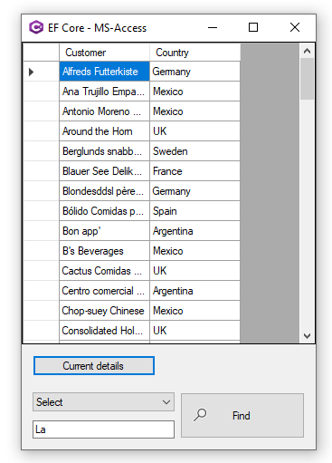

### About
This project models were created using the same scaffolding commands as with SQL-Server but not using the ScaffoldContextHelper. 

If someone wanted too they can modify the ScaffoldContextHelper project to do a) just Microsoft Access b) Microsoft Access and SQL-Server or even more providers. If there is enough interest Karen will renovate ScaffoldContextHelper to do multiple providers.

10/06/2020 added code for performing a conditional where

