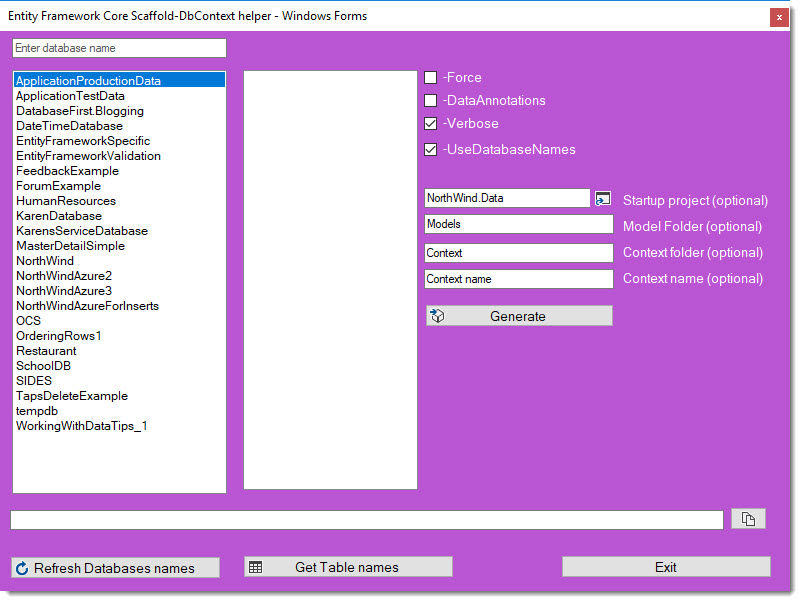

# Entity Framework Scaffold Context helper

This project provides a user interface for creating Entity Framework Core models using [Entity Framework Tools NuGet package](https://www.nuget.org/packages/Microsoft.EntityFrameworkCore.Tools/).

There are plenty of free tools and Visual Studio extensions such as [EF Core Power Tools](https://marketplace.visualstudio.com/items?itemName=ErikEJ.EFCorePowerTools) which have a good deal more functionality, the intent here is not to present another tool to create Entity Framework Core models better than the current tool set on the Internet but instead provide a tool for developers who are interested in a simple tool along with the opportunity to learn something new which a lot of new developer may be looking for.

### Database Providers

Find all current providers [here](https://docs.microsoft.com/en-us/ef/core/providers/).

[TechNet article](https://social.technet.microsoft.com/wiki/contents/articles/53258.windows-forms-entity-framework-core-reverse-engineering-databases.aspx)